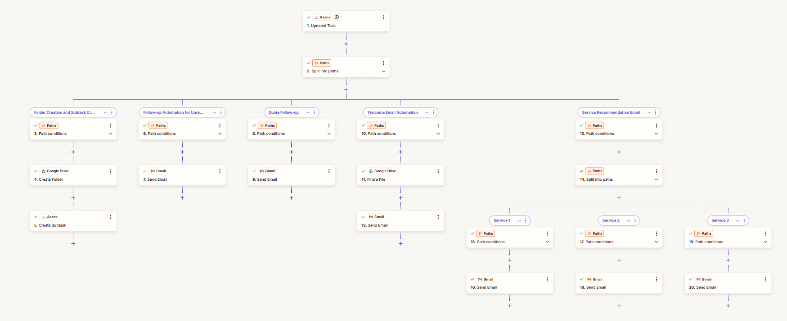
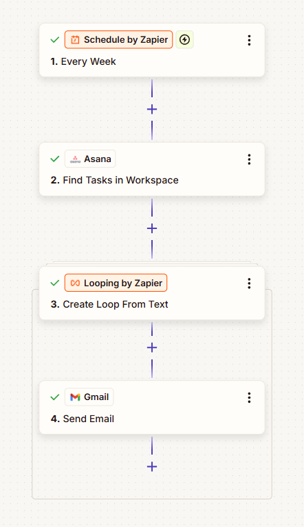

# ⚡ Lead Management Automation (Zapier + Asana)  

This repository documents a **lead management automation system** built with **Zapier** and **Asana**.  
It streamlines client onboarding, follow-ups, and service recommendations by automating repetitive tasks such as folder creation, email reminders, and quote tracking.  

---

## ✨ Features  

- **📂 Folder Creation & Subtask Automation**  
  Automatically creates client folders in Google Drive and generates subtasks in Asana.  

- **📧 Follow-up for Unresponsive Clients**  
  Sends automated reminder emails when leads don’t reply within a set timeframe.  

- **💬 Quote Follow-up**  
  Ensures prospects receive timely reminders about pending quotes.  

- **👋 Welcome Email Automation**  
  Sends a personalized welcome email with the correct client file links.  

- **🛠 Service Recommendation Emails**  
  Delivers tailored service recommendations based on client choices.  

- **⏰ Scheduled Follow-ups**  
  Includes two independent schedulers that automatically trigger follow-up sequences for:  
  - Pending quotes  
  - Unresponsive clients  

---

## 🛠 Tech Stack  

- **Zapier** → Workflow automation platform  
- **Asana** → Task & project management  
- **Google Drive** → File and folder organization  
- **Gmail** → Automated client communication  

---

## 📌 Workflow Overview  

The automation is structured into multiple **paths** and **schedulers**, triggered by updates in Asana and time-based events.  

### 🔀 Paths Overview  
  

1. Lead updates in **Asana** trigger a Zap.  
2. Zapier splits the workflow into multiple **paths**:  
   - Folder Creation & Subtask Creation  
   - Follow-up for Unresponsive Clients  
   - Quote Follow-up  
   - Welcome Email Automation  
   - Service Recommendation Email  

### ⏰ Schedulers Overview  
  

1. **Quote Follow-up Scheduler** → Sends reminders for pending quotes.  
2. **Unresponsive Client Scheduler** → Sends re-engagement emails to inactive leads.  

---

## 🎯 Benefits  

✅ Eliminates repetitive manual follow-ups  
✅ Speeds up client onboarding with automated welcome emails  
✅ Keeps sales leads engaged with timely responses  
✅ Organizes client files and tasks automatically  
✅ Prevents opportunities from slipping through the cracks with scheduled reminders  
